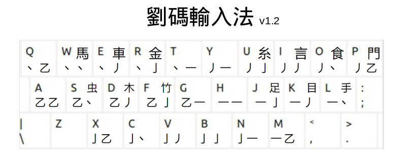

# rime-liuma
劉碼輸入法 / 刘码输入法 / Liuma input: A shape-based input method for RIME IME

author: 劉可力 / 刘可力 c m l y k k e - h o t m a i l - c o m

Version: 1.2 - 2024-11-04

First published 2024-10-16

## Description

The Liuma keyboard:

劉碼 / 刘码 Liuma is a shape-based input system that you can memorize in a few minutes.
It contains 29.512 different single characters, and 179.799 multi-character words
(counting traditional and simplified words separately).
You can write any of the 5.000 most common characters without having to scroll,
using only 4 letters per character (plus selection using the number keys).
It comes in to versions:
劉碼繁 liumafan where traditional characters are prioritized, and
刘码简 liumajian where simplified characters are prioritized.

If you find any bugs or have any comments about the system, feel free to write to 
the author at c m l y k k e - h o t m a i l - c o m.

## Tutorial

[Tutorial](instructions/TUTORIAL.md).

## RIME
To use the files in this project, you first have to install the RIME input method engine:

https://rime.im/

https://github.com/rime

## Installation

[Install Liuma input on PC](instructions/INSTALL_ON_PC.md).

[Install Liuma input on Android](instructions/INSTALL_ON_ANDROID.md).

## Generate .yaml files yourself

[Generate yaml files](instructions/GENERATE_NEW_YAML_FILES.md).

## The Design of Liuma

[Versions](instructions/VERSIONS.md).

[Character and word data](instructions/CHARACTER_AND_WORD_DATA.md).

