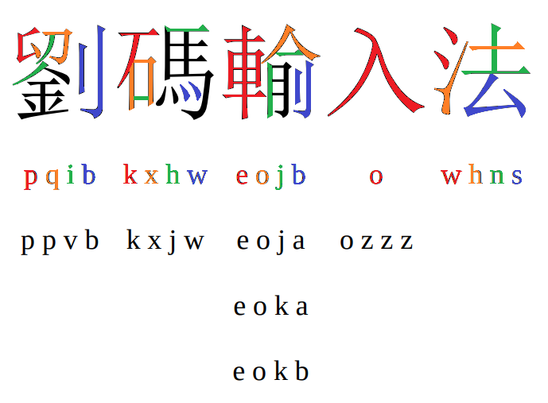
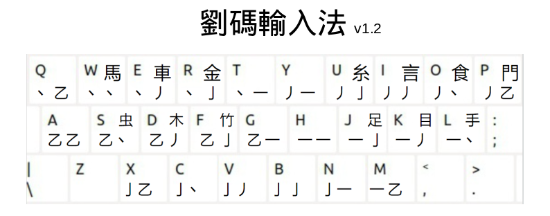

# rime-liuma
劉碼輸入法 / 刘码输入法 / Liuma input: A shape-based input method for RIME IME

author: 劉可力 / 刘可力 c m l y k k e - h o t m a i l - c o m

Version: 1.5 - 2025-09-19

First published 2024-10-16

## Description

The Liuma keyboard:

劉碼 / 刘码 Liuma is a shape-based input system that you can memorize in a few minutes.
It contains 28.312 different single characters, and 179.752 multi-character words
(counting traditional and simplified words separately).
You can write any of the 5.000 most common characters without having to scroll,
using only 4 letters per character (plus selection using the number keys).
It comes in to versions:
劉碼繁 liumafan where traditional characters are prioritized, and
刘码简 liumajian where simplified characters are prioritized.

If you find any bugs or have any comments about the system, feel free to write to c m l y k k e - h o t m a i l - c o m.

## Tutorial

[Tutorial](instructions/TUTORIAL.md).

## RIME
To use the files in this project, you first have to install the RIME input method engine:

https://rime.im/

https://github.com/rime

## Installation

[Install Liuma input on PC](instructions/INSTALL_ON_PC.md).

[Install Liuma input on Android](instructions/INSTALL_ON_ANDROID.md).

## Generate .yaml files yourself

[Generate yaml files](instructions/GENERATE_NEW_YAML_FILES.md).

## The Design of Liuma

[Versions](instructions/VERSIONS.md).

[Character and word data](instructions/CHARACTER_AND_WORD_DATA.md).

## Other Input Methods

For those interested in other methods, here are some learning resources:
(they are roughly ordered by the availability of resources in english)

* In general:
Here is a curated list of RIME input methods:
- https://github.com/ayaka14732/awesome-rime

* Wubi
- Classic text guide (in english)
- https://chinesemac.org/wubi/xing.html
- Interactive guide (in english):
- https://ndldd.github.io/wubi-trainer/app/#/info
- Youtube guide:五笔字型 Typing Chinese with WuBi, Video 1, lesson for beginners
- https://www.youtube.com/watch?v=v_w-Q6hDzL8
- Online practice site (in english)
- https://ndldd.github.io/wubi-trainer/app/#/info
- For RIME IME on github:
- https://github.com/rime/rime-wubi
- https://github.com/KyleBing/rime-wubi86-jidian
- https://github.com/sheepduke/rime-config

* Cangjie 5
- wikipedia:
- https://en.wikipedia.org/wiki/Cangjie_input_method
- Interactive guide (in english) (incomplete but very usefull):
- https://learningcangjie.com/demo/
- Cangjie typing practice (in english)
- https://cjtt.bzzt.io/
- For RIME IME on github:
- https://github.com/rime/rime-cangjie
- https://github.com/gkovacs/rime-cangjie-tradsimp

* Zhengma:
-  wikibook: 
- https://en.wikibooks.org/wiki/Zhengma_Input
- For RIME IME on github:
- https://github.com/Openvingen/rime-zhengma/
- https://github.com/vfreex/rime-zhengma
- https://github.com/chen32768/zhengma_for_rime

* Hanglie30 (Array30):
- wikibook:
- https://en.wikibooks.org/wiki/Guide_to_Array_input
- For RIME IME on github:
- https://github.com/rime/rime-array
- https://github.com/archerindigo/rime-array
- https://github.com/Reniastyc/RIME_array30_ex

* Dayi 4:
- wikibook:
- https://en.wikibooks.org/wiki/Guide_to_Dayi_input
- For RIME IME on github:
- https://github.com/chiahsien/RimeDayi

* Huma:
- officiel website (chinese):
- https://www.tiger-code.com/
- For RIME IME on github:
- https://github.com/ywxt/rime-huma
- https://github.com/humaIME/huma
- https://github.com/pimgeek/zen-tiger-code
- https://github.com/impishian/rime-ice-ziranma-zhengma-huma

* Xuma
- guide (chinese)
- https://ace-who.github.io/rime-xuma/
- For RIME IME on github:
- https://github.com/Ace-Who/rime-xuma?tab=readme-ov-file

* Yuhao:
- official website (chinese):
- https://shurufa.app/
- For RIME IME on github:
- https://github.com/forfudan/yuhao-ime-release

## Other Chinese site

* Sites where you can read texts:
- https://www.dotlanguages.com/features/
- Todaii: Easy Chinese - https://play.google.com/store/apps/details?id=mobi.eup.cnnews&hl=en
- https://www.maayot.com/
- https://mandarinbean.com/
- https://tadouchinese.com/
- https://www.thechairmansbao.com/
- https://www.lingq.com/en/learn-chinese-online/
- 

